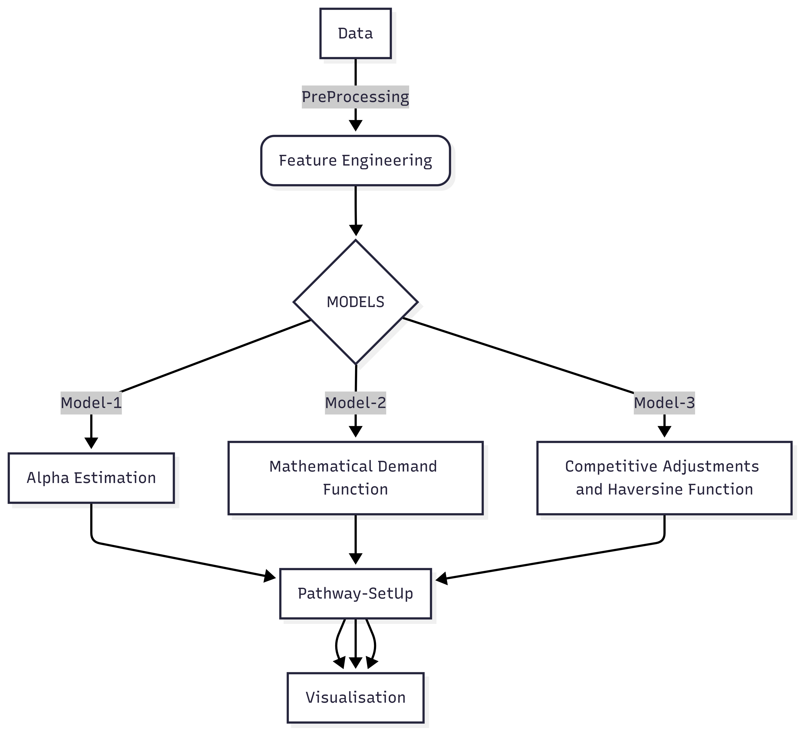
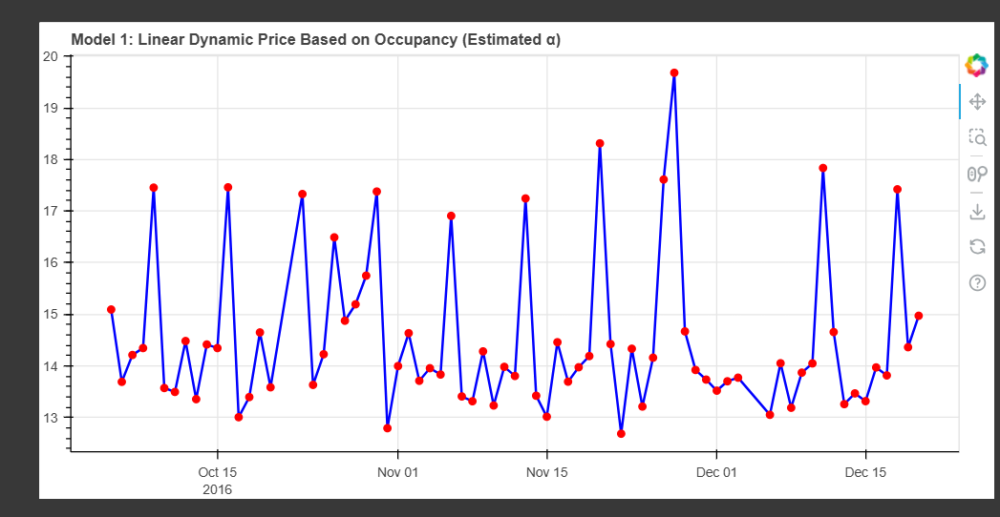
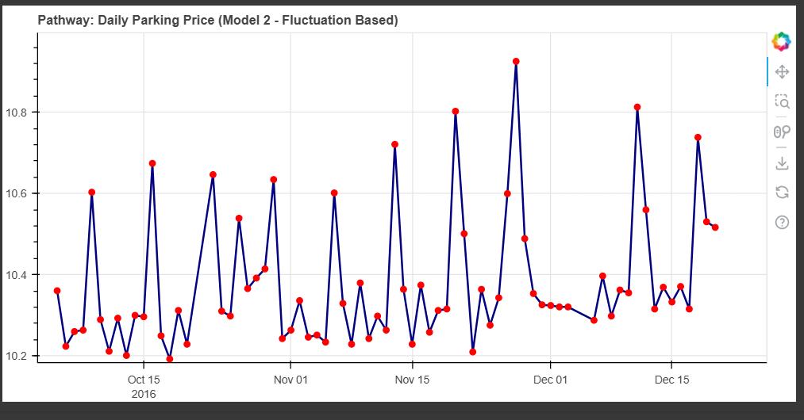
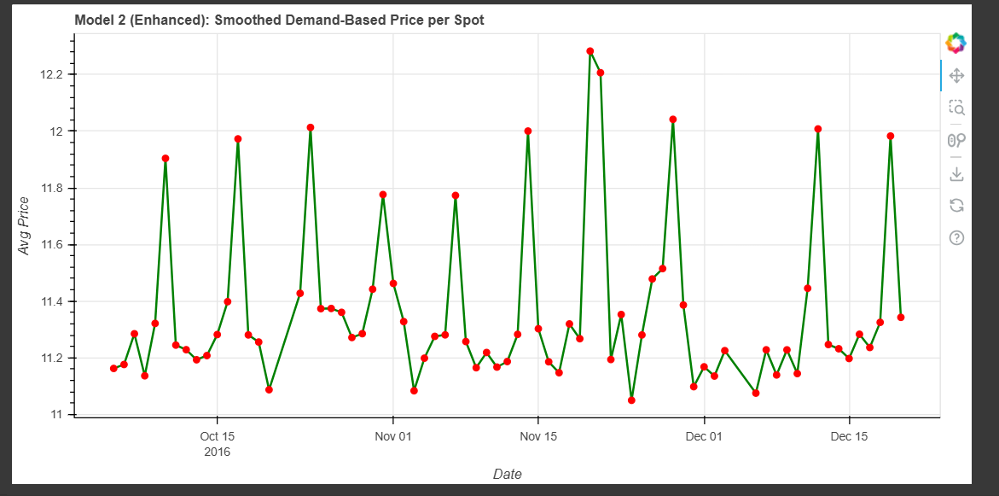
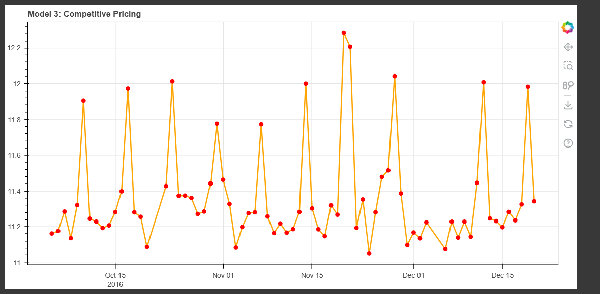

## Dynamic Pricing for Urban Parking Lots

This project explores intelligent dynamic pricing strategies for urban parking systems using real-time data from 14 parking spots. Three models are developed, progressively incorporating more complex decision-making features such as demand fluctuations and competitive pricing using location intelligence.

---

## 📉 Problem Statement

Static parking prices lead to inefficiencies like underutilized or overcrowded lots. To optimize utilization and revenue, dynamic pricing mechanisms are needed that adjust prices based on:

* Occupancy rates
* Queue lengths
* Time and day
* Traffic conditions
* Special events
* Vehicle types
* Competitive market behavior

---

## ⚖️ Data Description

* **Sources:** 14 urban parking spots
* **Duration:** 73 days
* **Sampling:** 18 time slots per day (8:00 AM – 4:30 PM, 30-minute intervals)
* **Features Used:**

  * Occupancy
  * Capacity
  * VehicleType
  * Latitude & Longitude
  * QueueLength
  * TrafficConditionNearby
  * LastUpdatedDate & LastUpdatedTime
  * IsSpecialDay

---

## ⚖ Model 1: Linear Price Update Based on Occupancy

### Logic:

```math
Price_{t+1} = Price_t + \alpha \cdot (\text{OccupancyRate})
```

* **OccupancyRate** = Occupancy / Capacity
* Fixed base price
* Estimated α using simple linear regression from historical deltaPrice vs lagged OccupancyRate

## 📊 Model 2: Demand-Based Pricing Function

### Logic:

```math
Demand = \alpha \cdot (\frac{\text{Occupancy}}{\text{Capacity}}) + \beta \cdot \text{QueueLength} - \gamma \cdot \text{Traffic} + \delta \cdot \text{IsSpecialDay} + \varepsilon \cdot \text{VehicleTypeWeight} + \tau \cdot \text{OccupancyTrend}
Price_t = BasePrice \cdot (1 + \lambda \cdot \text{NormalizedDemand})
```

### Enhancements:

* Normalization for stable pricing
* Smoothed price with exponential moving average
* Captures multi-factor influence

---

## 🌎 Model 3: Competitive Pricing Model

### ✨ Logic:

* **Location Intelligence** via Haversine distance
* Adjust prices based on competitor prices in a 0.5 km radius
* Competitive heuristics:

  * Decrease price if fully occupied and neighbors are cheaper
  * Increase price if neighbors are expensive

### Additional Features:

* "SuggestReroute" flag if occupancy > 95% and price > threshold
* Dynamic adjustments based on local market context

---
** Demand Function (Model 2 & 3)**
* We assume linear relationships between demand and influencing features:
* Occupancy rate directly increases demand
* Queue length increases urgency
* Traffic reduces demand (due to accessibility)
* Special days increase demand
* Vehicle types are weighted: cars & trucks have more impact
* Occupancy trend captures temporal increase/decrease
* Spatial competition is modeled via Haversine and relative pricing

🔹 Price Adjustment
* Model 1: linear additive pricing (α-estimate)
* Model 2: demand-weighted exponential model with normalization
* Model 3: demand price adjusted using local competition (±1 if cheaper/expensive)

## Conclusion




( since the data was available for just one spot , model_2 and model_3 look identical)
These models collectively demonstrate an incremental progression from simple to smart pricing mechanisms. The approach integrates economic reasoning, location context, and real-time data to create an adaptive and efficient parking pricing engine.
## 🚀 Tech Stack

* **Languages:** Python
* **Libraries:**

  * `pandas`, `numpy` for data handling and computation
  * `bokeh`, `panel` for interactive visualizations
  * `pathway` for real-time stream processing
* **Others:**

  * Exponential moving averages
  * Custom demand functions
  * Haversine formula for spatial analysis

---
